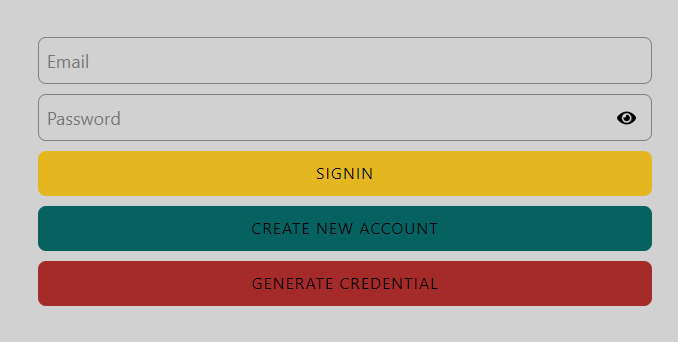

.

:star:This is the home page of imdb-clone web application.

Here you can see three buttons.

1.signin - to login to the web app.

2.create new account- if you want to create a new account.click here this will route to register page.

or else

3.generate credential - this button is created for testing purpose.if you click this button this will autofill the login information.

